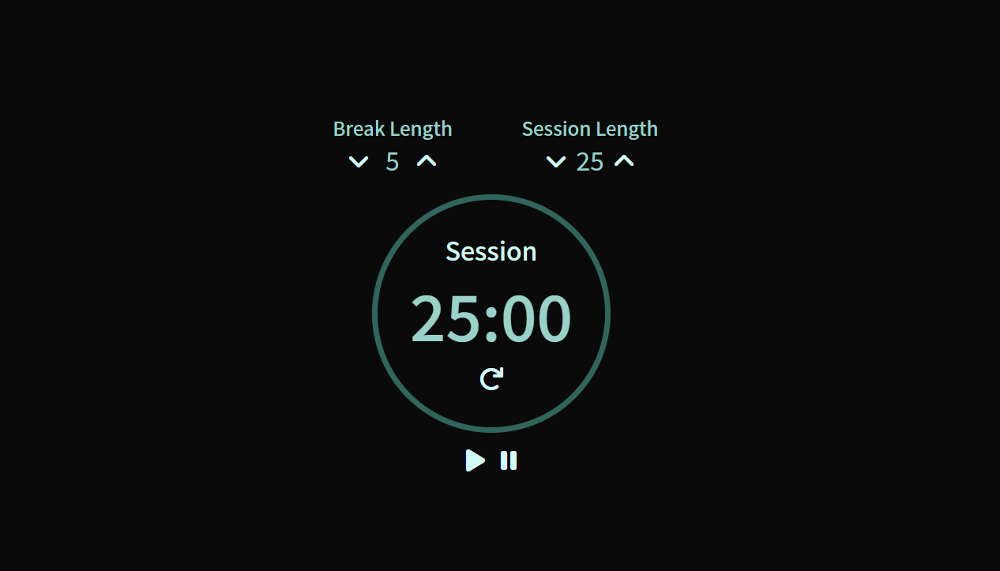

# Pomodoro Timer ⏱️

## Description

A Pomodoro timer keeps you focused and productive by scheduling work and break sessions consecutively.

The clock is initialized with a 25-minute timer and a 5-minute break. Session and break lengths can be modified and an alarm sound will play at when the timer(s) end. 

A FreeCodeCamp Front End Development Libraries project, with the objective to fulfill the user stories and get all of the tests to pass.

## Built With 

## Snapshot

## Link

## User Stories 
~~~~
User Story #1: I can see an element with id="break-label" that contains a string (e.g. "Break Length").

User Story #2: I can see an element with id="session-label" that contains a string (e.g. "Session Length").

User Story #3: I can see two clickable elements with corresponding IDs: id="break-decrement" and id="session-decrement".

User Story #4: I can see two clickable elements with corresponding IDs: id="break-increment" and id="session-increment".

User Story #5: I can see an element with a corresponding id="break-length", which by default (on load) displays a value of 5.

User Story #6: I can see an element with a corresponding id="session-length", which by default displays a value of 25.

User Story #7: I can see an element with a corresponding id="timer-label", that contains a string indicating a session is initialized (e.g. "Session").

User Story #8: I can see an element with corresponding id="time-left". NOTE: Paused or running, the value in this field should always be displayed in mm:ss format (i.e. 25:00).

User Story #9: I can see a clickable element with a corresponding id="start_stop".

User Story #10: I can see a clickable element with a corresponding id="reset".

User Story #11: When I click the element with the id of reset, any running timer should be stopped, the value within id="break-length" should return to 5, the value within id="session-length" should return to 25, and the element with id="time-left" should reset to its default state.

User Story #12: When I click the element with the id of break-decrement, the value within id="break-length" decrements by a value of 1, and I can see the updated value.

User Story #13: When I click the element with the id of break-increment, the value within id="break-length" increments by a value of 1, and I can see the updated value.

User Story #14: When I click the element with the id of session-decrement, the value within id="session-length" decrements by a value of 1, and I can see the updated value.

User Story #15: When I click the element with the id of session-increment, the value within id="session-length" increments by a value of 1, and I can see the updated value.

User Story #16: I should not be able to set a session or break length to <= 0.

User Story #17: I should not be able to set a session or break length to > 60.

User Story #18: When I first click the element with id="start_stop", the timer should begin running from the value currently displayed in id="session-length", even if the value has been incremented or decremented from the original value of 25.

User Story #19: If the timer is running, the element with the id of time-left should display the remaining time in mm:ss format (decrementing by a value of 1 and updating the display every 1000ms).

User Story #20: If the timer is running and I click the element with id="start_stop", the countdown should pause.

User Story #21: If the timer is paused and I click the element with id="start_stop", the countdown should resume running from the point at which it was paused.

User Story #22: When a session countdown reaches zero (NOTE: timer MUST reach 00:00), and a new countdown begins, the element with the id of timer-label should display a string indicating a break has begun.

User Story #23: When a session countdown reaches zero (NOTE: timer MUST reach 00:00), a new break countdown should begin, counting down from the value currently displayed in the id="break-length" element.

User Story #24: When a break countdown reaches zero (NOTE: timer MUST reach 00:00), and a new countdown begins, the element with the id of timer-label should display a string indicating a session has begun.

User Story #25: When a break countdown reaches zero (NOTE: timer MUST reach 00:00), a new session countdown should begin, counting down from the value currently displayed in the id="session-length" element.

User Story #26: When a countdown reaches zero (NOTE: timer MUST reach 00:00), a sound indicating that time is up should play. This should utilize an HTML5 audio tag and have a corresponding id="beep".

User Story #27: The audio element with id="beep" must be 1 second or longer.

User Story #28: The audio element with id of beep must stop playing and be rewound to the beginning when the element with the id of reset is clicked.
~~~~

## Credits

Favicon: 
[CreativeCons](https://www.flaticon.com/free-icons/alarm)

## License
Licensed under the MIT license.

## Questions 
[Email Me](Chloe.a.harris17@gmail.com) if you have any questions.

Check out more of my work on [GitHub](https://github.com/chloeharris1).
  
